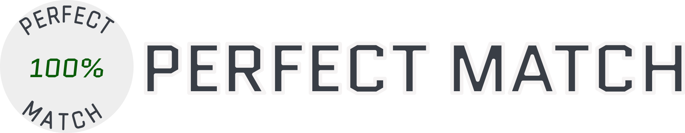

#  #


A game that challenges you to draw a perfect circle.

## Built with ##

- Angular 14
- Tailwind 3.0
- TypeScript 4.9

## How to run ##

To run the application run the command:

``` sh
  npm install &&
  ng s
```

## How it works ##

Calculate the Centroid of the figure; then the Eucleadian distance of each point in relation to the Centroid is calculated, finally the Standard Deviation is calculated and a percentage is generated from it.

## Author ##

Made by [Yann Carvalho](https://www.linkedin.com/in/yann-carvalho-764abab6/).

## Licensing ##

What about my country is licensed under the Apache 2.0 License. See [LICENSE](LICENSE) for the full license text.
